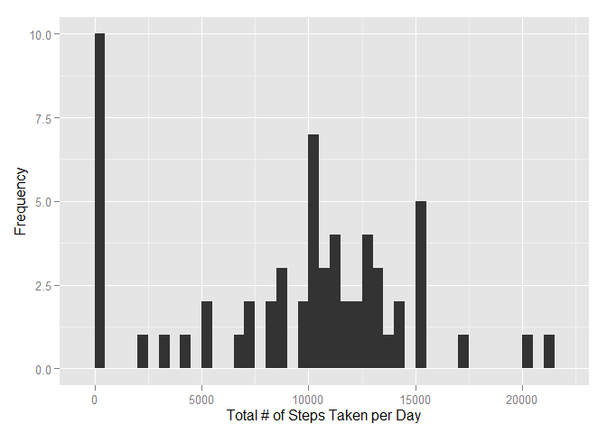
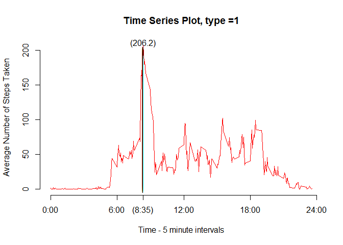
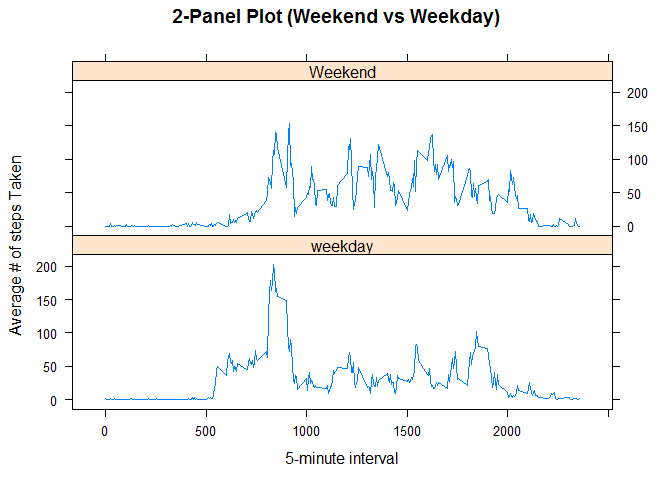

# PA1_template
Harish Jose  
Saturday, January 10, 2015  

##Reproducible Research: Peer Assessment 1
The report starts below.

## 1) Loading and preprocessing the data


```r
setwd("C:/Users/Harish/Desktop/Coursera/Reproducible research/repdata_data_activity")
data <- read.csv("activity.csv")
total.steps <- tapply(data$steps, data$date, FUN = sum, na.rm = TRUE)
head(total.steps)
```

```
## 2012-10-01 2012-10-02 2012-10-03 2012-10-04 2012-10-05 2012-10-06 
##          0        126      11352      12116      13294      15420
```

No preprocessing was deemed necessary. The data has been stored into "data". The total.steps contain the tota steps per date.

## 2) What is mean total number of steps taken per day?

- a) Histogram:


```r
library(ggplot2)
qplot(total.steps, xlab = "Total # of Steps Taken per Day", ylab = "Frequency", binwidth=500)
```

 

- b) Mean and Median:


```r
paste("The mean of the activity data total number of steps is ", mean(total.steps), " and the median is ", median(total.steps))
```

```
## [1] "The mean of the activity data total number of steps is  9354.22950819672  and the median is  10395"
```

## 3) What is the average daily activity pattern?

- a) Time series Plot:


```r
meaninterval <- aggregate(x = list(steps = data$steps), by = list(interval = data$interval), 
    FUN = mean, na.rm = TRUE)
plot(meaninterval$interval, meaninterval$steps, axes = F, type = "l", 
    col = "red", xlab = "Time - 5 minute intervals", ylab = "Average Number of Steps Taken", main = "Time Series Plot, type =1")
axis(1, at = c(0, 600, 835, 1200, 1800, 2400), label = c("0:00", "6:00", "(8:35)", "12:00", 
    "18:00", "24:00"))
axis(2)
text(835, 210, "(206.2)")
x<-(1:200)
text(835, x, "|")
```

 

- b) Data containing the maximum number of steps:


```r
which.max(meaninterval[,2])
```

```
## [1] 104
```

```r
meaninterval[104,]
```

```
##     interval steps
## 104      835 206.2
```

The interval starting at 8:35 has the most steps = 206.2.

## 4) Imputing missing values

- a) Number of missing values:


```r
length(which(is.na(data$steps)))
```

```
## [1] 2304
```

There are a total of 2304 NA values.

- b) Strategy for imputing NA values:

The strategy chosen is to use the median value in place of all NA values.

- c) Creating new data set with median value:


```r
library(Hmisc)
```

```
## Loading required package: grid
## Loading required package: lattice
## Loading required package: survival
## Loading required package: splines
## Loading required package: Formula
## 
## Attaching package: 'Hmisc'
## 
## The following objects are masked from 'package:base':
## 
##     format.pval, round.POSIXt, trunc.POSIXt, units
```

```r
imputed<- data
imputed$steps <- impute(data$steps, median)
```

- d) Histogram with total number of steps for each day/ New mean and Median:


```r
total.steps2 <- tapply(imputed$steps, imputed$date, sum, TRUE)
qplot(total.steps2, xlab="Total # of Steps Taken per Day", ylab="Frequency", binwidth=500)
```

 


```r
paste("The mean of the activity data total number of steps is ", mean(total.steps2), " and the median is ", median(total.steps2))
```

```
## [1] "The mean of the activity data total number of steps is  9355.22950819672  and the median is  10396"
```

Do these values differ from the estimates from the first part of the assignment?:

- The values are almost the same. Original mean data was 9354 and the new mean is 9355. The original median was 10395 and the new median is 10396. This might be because I chose to use the median value for imputing.

What is the impact of imputing missing data on the estimates of the total daily number of steps?

- Since the estimates were very close to one another, there was minimal impact of imputing missing data.

## 5) Are there differences in activity patterns between weekdays and weekends?

- a) Create a new factor variable in the dataset with two levels - "weekday" and "weekend" 

A new variable (DayType) was created using the timeDate package and an ifelse statement.


```r
library(timeDate)
```

```
## Warning: package 'timeDate' was built under R version 3.1.2
```

```r
imputed$DayType <- ifelse(isWeekend(imputed$date), 'Weekend', 'weekday')
```
- b) Make a panel plot containing a time series plot 


```r
meaninterval2 <- aggregate(steps ~ interval + DayType, data = imputed, mean)
library(lattice)

xyplot(meaninterval2$steps ~ meaninterval2$interval|meaninterval2$DayType, main="2-Panel Plot (Weekend vs Weekday)",xlab="5-minute interval", ylab="Average # of steps Taken",layout=c(1,2), type="l")
```

 

- We can see from the panel plot that there is a spike during the beginning of weekday, which then seemingly levels off. The activity on the weekends seem to be more than during the weekdays (except for the initial spike for weekdays.)
